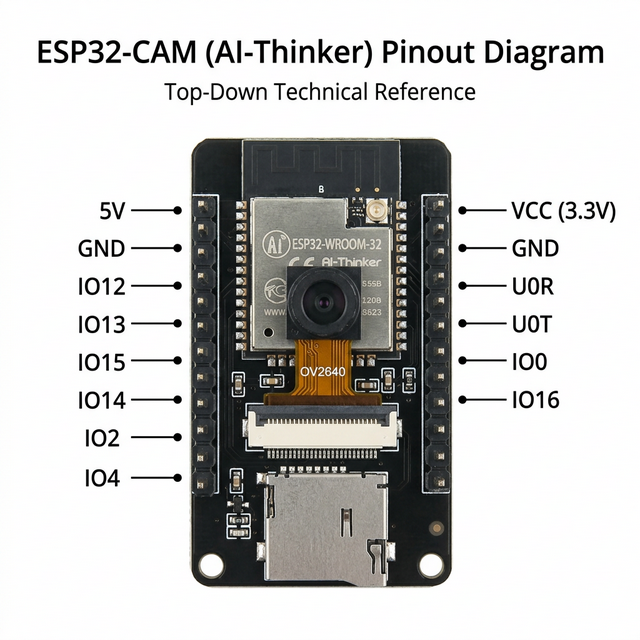
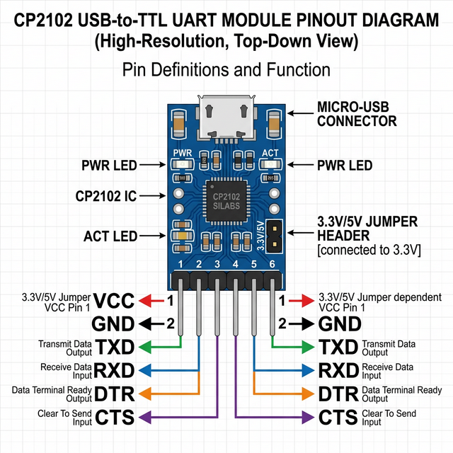
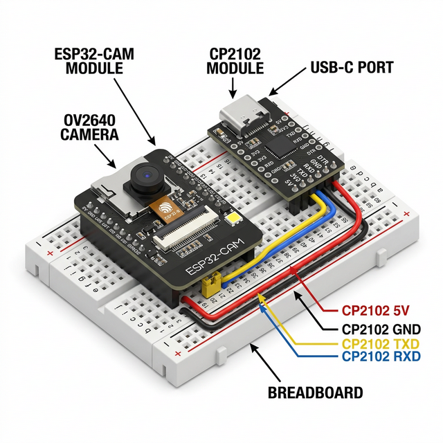
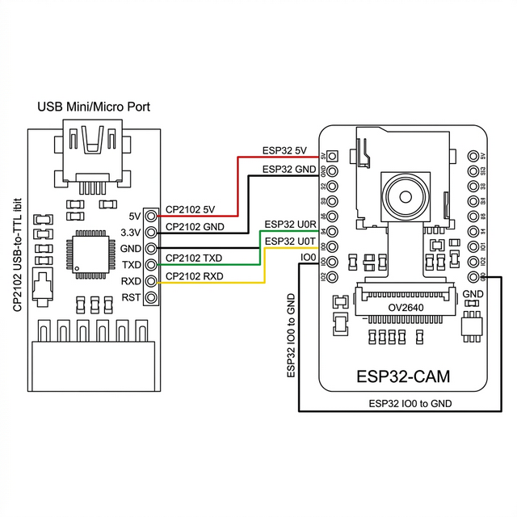
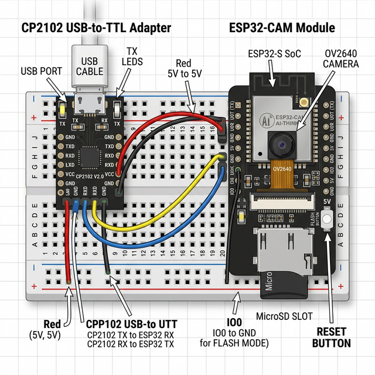
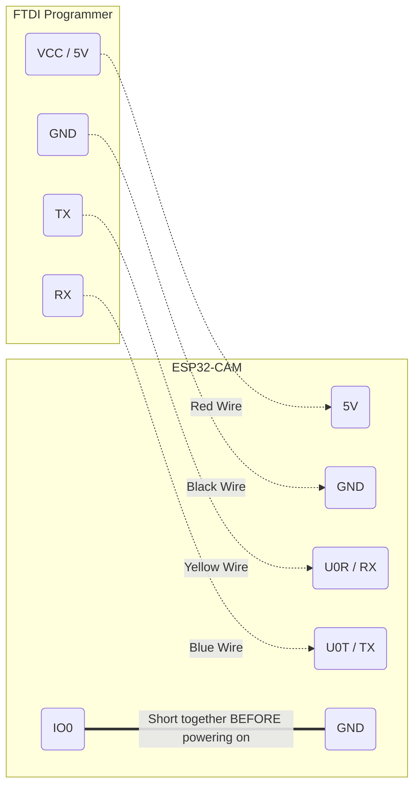
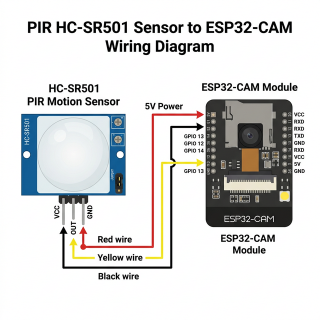
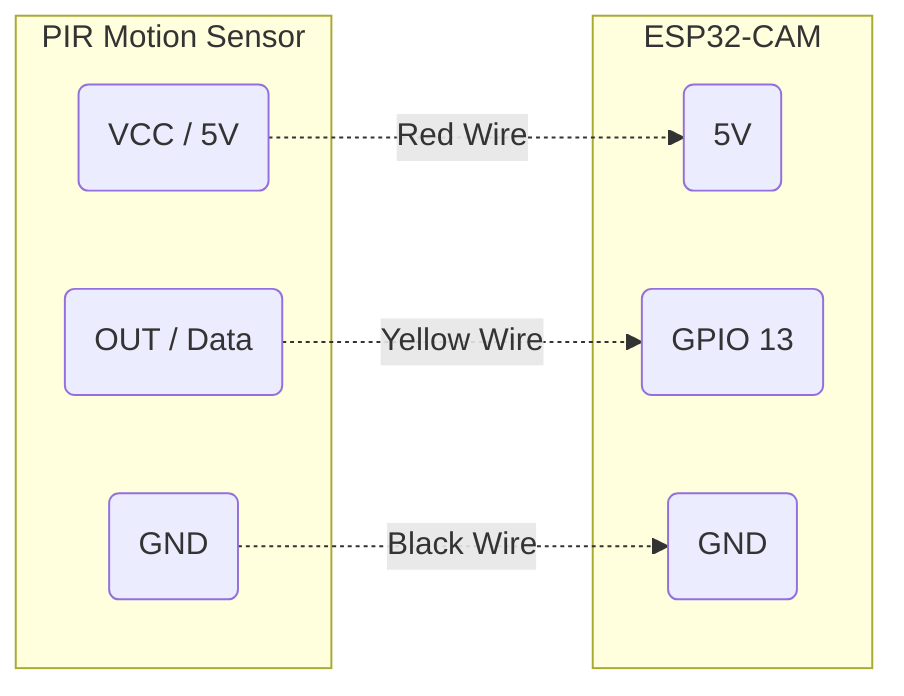
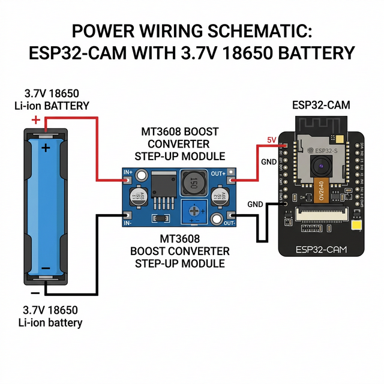
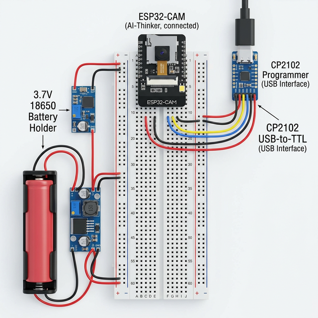

# Smart Parking Hardware Connection Guide

## 0. Pinout Reference (Port Names)
Before starting the connections, use these diagrams to identify the port names (pins) on your components.

### ESP32-CAM (AI-Thinker) Pinout


| Pin Label | Function |
|-----------|----------|
| **5V** | Power Input (5V) |
| **GND** | Ground |
| **U0R** | UART Receiver (RX) |
| **U0T** | UART Transmitter (TX) |
| **IO0** | Flash Mode Trigger (Short to GND to upload) |
| **VCC** | 3.3V Output/Input |

### CP2102 USB-to-TTL Pinout


| Pin Label | Function |
|-----------|----------|
| **5V** | Power Output (5V) |
| **GND** | Ground |
| **TXD** | Data Out (Connect to ESP32 RX) |
| **RXD** | Data In (Connect to ESP32 TX) |

---

### Breadboard Wiring with Port Labels
This 3D diagram shows the exact breadboard placement and labeling for the ports.



### Detailed Port-to-Port Connection Diagram
This diagram shows exactly which pin connect to which, with explicit labels for every wire.



## 1. ESP32-CAM to CP2102 Programmer (For Uploading Code)
To program the ESP32-CAM, you need a USB-to-TTL programmer (like an **FTDI FT232RL** or a **CP2102 module**). 

### If you only have **5 Jumper Wires** (Male-to-Female):
You have just enough! Use this diagram showing exactly how to use the breadboard as a bridge for your 5 wires:


1. **Mount the ESP32-CAM:** Plug your ESP32-CAM into the breadboard (straddling the center gap).
2. **Wire 1 (Power):** Female end on **CP2102 5V** $\rightarrow$ Male end in the breadboard hole for **ESP32 5V**.
3. **Wire 2 (Ground):** Female end on **CP2102 GND** $\rightarrow$ Male end in the breadboard hole for **ESP32 GND**.
4. **Wire 3 (Data):** Female end on **CP2102 RXD** $\rightarrow$ Male end in the breadboard hole for **ESP32 U0T (TX)**.
5. **Wire 4 (Data):** Female end on **CP2102 TXD** $\rightarrow$ Male end in the breadboard hole for **ESP32 U0R (RX)**.
6. **Wire 5 (Flash Mode):** If your breadboard has no blue rails, just make a "Jumper Loop" directly on the breadboard:
   - Plug one end of your 5th wire into the breadboard hole for **IO0**.
   - Plug the other end of that same wire into the breadboard hole for the **GND pin** right next to it on the same side of the ESP32-CAM.

> [!TIP]
> **No Blue Rail? No Problem!** 
> Most breadboards have two long columns on the sides for power. Even if they aren't blue or red, they work the same! But using the "Jumper Loop" mentioned in Step 6 is even easier since you only have 5 wires.

---

## 2. Option B: The Junction Method (Alternative)
If the breadboard is confusing to mount, you can use the breadboard simply as a "connecting block" for your wires, but this requires **8 wires**.

> [!NOTE]
> **Using a Breadboard with Male-Female Wires:**
> 1. Plug the **Female** end of a wire onto the ESP32-CAM's pin.
> 2. Plug the **Male** end of that same wire into a row on the Breadboard.
> 3. Use another Male-to-Female wire: plug the **Male** end into the **SAME** row as before, and the **Female** end onto the CP2102's corresponding pin.

> [!CAUTION]
> Ensure your FTDI programmer is set to **3.3V** or **5V** depending on your power pin. The ESP32-CAM logic is 3.3V, but the `5V` pin on the ESP32 can take 5V power. **NEVER connect 5V to the 3.3V pin.**
> 
> Also, you **MUST short IO0 (GPIO 0) to GND** to put the board into flashing mode.



## Connection Table (FTDI or CP2102)
| Programmer Pin | ESP32-CAM Pin | Purpose |
|----------------|---------------|---------|
| **5V / VCC** | **5V** | Power |
| **GND** | **GND** | Ground |
| **TX / TXO** | **U0R** (RX) | Send Data |
| **RX / RXI** | **U0T** (TX) | Receive Data |

## The "Flashing Mode" Trick
To actually install the code, the ESP32 chip needs to know you want to upload a new script.
1. Connect a jumper wire between **IO0** and **GND** on the ESP32-CAM.
2. Plug the FTDI programmer into your computer's USB port.
3. Hit the physical "Reset" button on the back of the ESP32-CAM once.
4. Click "Upload" in your Arduino IDE!



## 2. ESP32-CAM Normal Operation (Running the code)

Once the code is uploaded successfully:
1. Disconnect the power.
2. **REMOVE the jumper wire between IO0 and GND**.
3. Reconnect the power (through the FTDI or a dedicated 5V power supply). The camera will now boot normally and start taking pictures.

## 3. Motion Sensor Integration (PIR HC-SR501) - *Optional API Saver*

If you decide to go with the approach that saves API requests by only taking a picture when movement is detected (Alternative Method #1), here is how you connect a standard PIR sensor to the ESP32-CAM.




*Note: GPIO 13 is one of the few safe pins to use on the ESP32-CAM that doesn't interfere with the SD Card or the Camera module.*

---

## 4. Powering from a 3.7V Li-ion Battery (with MT3608)

The ESP32-CAM requires a stable 5V input for the camera and Wi-Fi to function properly without brownouts. Since a standard 18650 Li-ion battery only outputs 3.7V - 4.2V, we must use an **MT3608 Boost Converter** to step the voltage up to 5V.

> [!CAUTION]
> **IMPORTANT STEP:** Before connecting the MT3608 to your ESP32-CAM, connect the battery to the MT3608 and use a multimeter on the `VOUT+` / `VOUT-` pads. Turn the small golden screw on the blue potentiometer until the multimeter reads exactly **5.0V to 5.1V**. 
> If you do not do this, you may deliver too much voltage and destroy the ESP32!



```mermaid
graph LR
    subgraph 18650 Battery Holder
        BATT_POS(Positive +)
        BATT_NEG(Negative -)
    end

    subgraph MT3608 Boost Converter
        MT_VIN(VIN+)
        MT_GND_IN(VIN-)
        MT_VOUT(VOUT+)
        MT_GND_OUT(VOUT-)
    end

    subgraph ESP32-CAM
        ESP_5V(5V)
        ESP_GND(GND)
    end

    BATT_POS -.-> |Red Wire| MT_VIN
    BATT_NEG -.-> |Black Wire| MT_GND_IN
    
    MT_VOUT -.-> |Red Wire (5V Adjusted)| ESP_5V
    MT_GND_OUT -.-> |Black Wire| ESP_GND
```

---

## 5. Master Circuit Diagram (Full Assembly)

This diagram shows how to combine every component on a single breadboard: **ESP32-CAM**, **CP2102 Programmer**, **18650 Battery Holder**, and the **MT3608 Boost Converter**.



### Assembly Tips:
1. **Common Ground:** Ensure the ground (GND) is shared across all components via the breadboard's blue rail.
2. **Voltage Protection:** Tuned your MT3608 to **exactly 5.0V** before connecting it to the ESP32-CAM.
3. **Heat Management:** Avoid packing components too tightly; the ESP32-CAM needs some space for airflow during Wi-Fi transmission.

---

## 6. Pro-Tip: Large Breadboard Mounting
If you have a large 830-point breadboard, the ESP32-CAM can be very wide and cover all your holes.

> [!WARNING]
> **CRITICAL MOUNTING WARNING:** 
> Do **NOT** plug the ESP32-CAM lengthwise along the board.
> On a breadboard, all 5 holes in a vertical column are connected together. If you plug the ESP32-CAM so that both its left and right pins are in the same columns, you will **short circuit** your board and likely destroy the chip.
> 
> **Correct Way:** The ESP32-CAM must **straddle the center notch** (the gap) so that the left pins are on a different side from the right pins.


**The "Offset Hack":**
If the module is too wide to plug in jumper wires, plug it so that the pins on one side are in the **very last row of holes** at the edge of the board. This leaves the other side with plenty of open holes for your wires!


